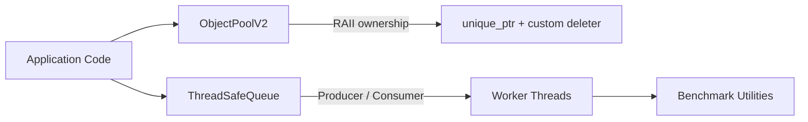
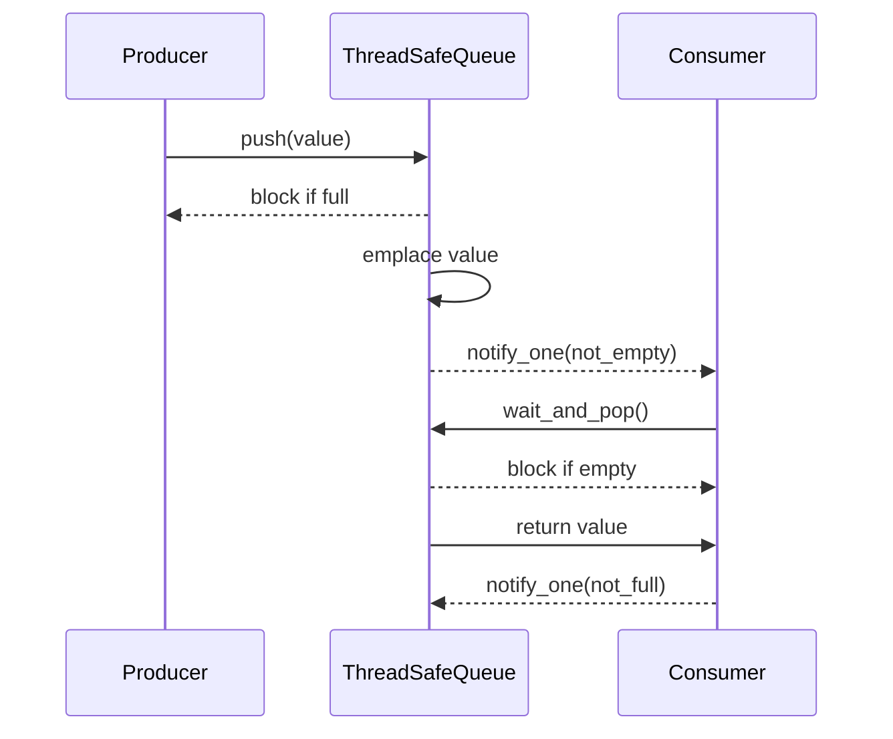

# Memory Engine

> A production-quality C++ memory management library, built phase by phase to understand how real systems like Redis, Nginx, RocksDB, and Envoy manage memory at scale.

---

## What This Is

This is not a tutorial. This is an engineering project built the way it would be built at Google, Meta, or Cloudflare — with documented decisions, benchmarks, and production-grade code.

---

## Project Status

| Area                 | Status                           |
| -------------------- | -------------------------------- |
| ObjectPool V1        | ✅ Complete                      |
| ObjectPool V2        | ✅ Complete                      |
| ThreadSafeQueue      | ✅ Complete                      |
| Benchmark framework  | ✅ Complete                      |
| Examples             | ✅ Complete                      |
| Config               | ✅ Complete                      |
| Exceptions           | ✅ Complete                      |
| Project architecture | ✅ Complete                      |
| Core implementation  | ✅ Complete                      |
| Tests                | 🟡 Should be expanded            |
| Benchmark results    | 🟡 Need to be run and documented |
| Documentation        | 🟡 Should be completed           |

---

## At A Glance

### Architecture



### Ownership Model

```mermaid
flowchart TD
    Pool[ObjectPoolV2] -->|acquire()| Ptr[unique_ptr<T, Deleter>]
    Ptr -->|scope ends| Deleter[Custom Deleter]
    Deleter -->|release()| Pool
    Ptr -->|owns exactly one object| Obj[Constructed Object]
```

### Queue Synchronization



### Benchmark Screenshots

Place captured benchmark charts here when you run the suite locally. Suggested captures:

- allocation throughput
- queue throughput
- latency comparison
- memory reuse comparison

Example layout:


---

## Project Phases

| Phase | Branch                      | Status | What You Build                       |
| ----- | --------------------------- | ------ | ------------------------------------ |
| 0     | `phase/0-architecture`      | ✅     | Architecture doc — the WHY           |
| 1     | `phase/1-benchmark`         | ✅     | Timer, BenchmarkRunner, Statistics   |
| 2     | `phase/2-allocation-study`  | ✅     | Measure new/malloc/unique/shared_ptr |
| 3     | `phase/3-object-pool`       | ✅     | ObjectPool v1 (hardcoded type)       |
| 4     | `phase/4-generic-pool`      | ✅     | ObjectPool\<T\> + PooledPtr\<T\>     |
| 5     | `phase/5-thread-safety`     | ✅     | ThreadSafePool with mutex + CV       |
| 6     | `phase/6-thread-safe-queue` | ✅     | ThreadSafeQueue (MPMC)               |
| 7     | `phase/7-smart-pointers`    | ⬜     | Custom deleters + STL allocator      |
| 8     | `phase/8-benchmarks`        | ✅     | Full comparison benchmark suite      |
| 9     | `phase/9-production`        | ⬜     | Arena, Slab, Lock-Free ideas         |

---

## Directory Structure

```
memory-engine/
├── CMakeLists.txt
├── README.md
├── docs/
│   ├── architecture.md          ← Phase 0: The WHY
│   ├── github-workflow.md       ← Git branching strategy
│   ├── phase1-benchmark.md      ← Phase 1 learning notes
│   └── phase2-allocation.md     ← Phase 2 learning notes
├── include/
│   ├── benchmark/
│   │   └── Timer.hpp            ← Timer, ScopedTimer, BenchmarkRunner
│   ├── pool/
│   │   ├── ObjectPool_v1.hpp    ← Phase 3: single-type pool
│   │   ├── ObjectPool.hpp       ← Phase 4: template<T> + PooledPtr
│   │   └── ThreadSafePool.hpp   ← Phase 5: mutex-protected pool
│   └── queue/
│       └── ThreadSafeQueue.hpp  ← Phase 6: MPMC blocking queue
└── src/
    ├── allocation_study.cpp
    ├── full_benchmarks.cpp
    └── ...
```

---

## Build

```bash
# Debug build (with AddressSanitizer)
mkdir build && cd build
cmake -DCMAKE_BUILD_TYPE=Debug ..
make

# Release build (optimized, for benchmarks)
cmake -DCMAKE_BUILD_TYPE=Release ..
make
```

---

## Run Benchmarks

```bash
cd build

# Phase 2: How expensive is new/delete really?
./phase2_allocation

# Phase 8: Full comparison — pool vs heap
./phase8_benchmarks
```

---

## Performance Table

Use this section to paste measured results from your benchmark runs. The numbers below are placeholders until you capture real data on your machine.

| Benchmark          | Ops/sec | Avg ns/op | Peak Memory | Notes                    |
| ------------------ | ------: | --------: | ----------: | ------------------------ |
| `new/delete`       |     TBD |       TBD |         TBD | Baseline heap allocation |
| `std::make_unique` |     TBD |       TBD |         TBD | Smart-pointer baseline   |
| `ObjectPool`       |     TBD |       TBD |         TBD | Fixed-size pool          |
| `ObjectPoolV2`     |     TBD |       TBD |         TBD | Raw-memory pool          |
| `ThreadSafeQueue`  |     TBD |       TBD |         TBD | Blocking bounded queue   |

---

## Key Design Decisions

| Decision             | Choice                     | Why                            |
| -------------------- | -------------------------- | ------------------------------ |
| Free list            | Intrusive (inside objects) | Zero extra memory              |
| Pool exhaustion      | Return nullptr             | Systems code avoids exceptions |
| Thread safety        | mutex + condition_variable | Correct before fast            |
| Queue implementation | std::deque + mutex         | Simple, correct, debuggable    |
| Ownership            | RAII (PooledPtr)           | No leaks by design             |
| Templating           | template\<typename T\>     | Works for any object           |

---

## What You'll Understand After This

- Why `new/delete` involves locks, searches, and syscalls
- What heap fragmentation is and why pools eliminate it
- Why cache locality matters at 100K requests/second
- How Redis, Nginx, and RocksDB solve this in practice
- When object pools are NOT the right answer
- How mutex, lock_guard, unique_lock, and condition_variable work
- What RAII means and why it prevents every class of memory leak
- How to measure, benchmark, and prove your optimization actually works

---

## Engineering Principles Applied

1. **Measure before optimizing** — Phase 1 and 2 exist before any pool code
2. **Correct before fast** — single-threaded pool before thread-safe
3. **Simple before generic** — hardcoded type before template
4. **RAII everywhere** — no raw new/delete in business logic
5. **Documented decisions** — every design choice has a written reason

---

## Inspired By

- jemalloc (Facebook) — thread-local free lists
- tcmalloc (Google) — per-thread caches
- Redis zmalloc — simple, instrumented allocator
- Nginx pool — per-request memory pools
- RocksDB Arena — bump-pointer allocator
