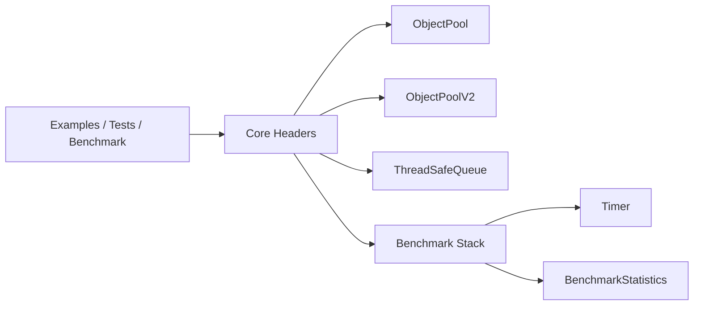

# Architecture Deep Dive

This document describes the implementation architecture of Memory Engine and how each module interacts at runtime.

## Goals

- Provide predictable allocation behavior via bounded pools.
- Provide deterministic producer-consumer coordination.
- Keep code header-first and easy to embed in small projects.
- Keep APIs simple and strongly RAII-oriented.

## Module Map

- include/memory_engine/object_pool.hpp: fixed-capacity pool over pre-constructed objects.
- include/memory_engine/object_pool_v2.hpp: raw-storage pool with explicit construct/destroy.
- include/memory_engine/thread_safe_queue.hpp: bounded blocking queue with shutdown semantics.
- include/memory_engine/timer.hpp: monotonic timing utility.
- include/memory_engine/statistics.hpp: benchmark sample aggregation.
- include/memory_engine/benchmark.hpp: benchmark runner.
- include/memory_engine/reporter.hpp: result formatting.
- include/memory_engine/config.hpp: shared constants and PoolStatistics.
- include/memory_engine/exception.hpp: domain exceptions.

## Runtime Interaction

## Ownership and Lifetime

- Pool handles are unique_ptr with custom deleter.
- Releasing is automatic on scope exit.
- Pool objects are intentionally non-copyable and non-movable to keep deleter back-pointers stable.

## Concurrency Boundary

- ObjectPool and ObjectPoolV2 are not synchronized.
- ThreadSafeQueue is internally synchronized with mutex + condition_variable.
- Cross-thread pool usage requires external synchronization.

## Complexity Summary

- ObjectPool acquire/release: O(1).
- ObjectPoolV2 acquire/release: O(1) plus constructor/destructor cost of T.
- ThreadSafeQueue push/pop: O(1) amortized under lock.

## Operational Trade-offs

- Bounded capacity avoids unbounded memory growth but can return null (pool) or block (queue).
- Mutex + condition_variable favors correctness and portability over lock-free complexity.
- Header-first design simplifies integration but can increase compile time.
